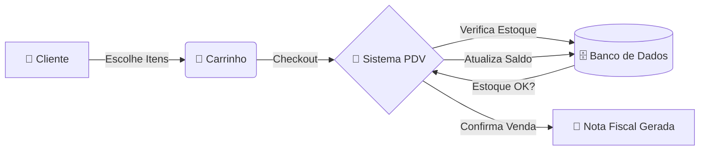

<h1 align="center">
  🛒 PDV Loja - Sistema de Ponto de Venda
</h1>

<p align="center">
  
  
  
  
</p>

<p align="center">
 <a href="#-sobre-o-projeto">Sobre</a> •
 <a href="#-funcionalidades">Funcionalidades</a> •
 <a href="#-fluxo-da-aplicação">Fluxo</a> •
 <a href="#-tecnologias">Tecnologias</a> •
 <a href="#-como-executar">Como Executar</a> •
 <a href="#-autor">Autor</a>
</p>

<p align="center">
 <a href="#-sobre-o-projeto">Sobre</a> •
 <a href="#-funcionalidades">Funcionalidades</a> •
 <a href="#-fluxo-da-aplicação">Fluxo</a> •
 <a href="#-tecnologias">Tecnologias</a> •
 <a href="#-como-executar">Como Executar</a> •
 <a href="#-autor">Autor</a>
</p>

---

## 💻 Sobre o projeto

O **PDV Loja** é uma API desenvolvida para simular a operação de um caixa de supermercado ou loja. O foco principal é o gerenciamento correto de valores monetários e o controle transacional de estoque.

Este projeto é meu portfólio de estudos em Java, demonstrando a aplicação prática de conceitos de Engenharia de Software e arquitetura de sistemas.

---

## ⚙️ Funcionalidades

### 📦 Estoque & Produtos
- ✅ **CRUD Completo:** Cadastro, leitura, atualização e remoção de produtos.
- 📉 **Baixa Automática:** O estoque é descontado automaticamente ao finalizar uma venda.
- 🚫 **Bloqueio de Venda:** O sistema impede vendas se o estoque for insuficiente.

### 💰 Vendas & Caixa
- 🛒 **Carrinho de Compras:** Adição dinâmica de itens.
- 🧮 **Cálculos Precisos:** Uso de `BigDecimal` para garantir que R$ 0,10 + R$ 0,20 seja exatamente R$ 0,30.
- 🧾 **Histórico:** Consulta de vendas realizadas e seus detalhes.

---

## 🔄 Fluxo da Aplicação

Como a aplicação é focada no Back-end, este é o fluxo lógico dos dados:



Ou, simplificando o processo via API:

1.  🆕 **Produto Criado** ( `POST /produtos` )
2.  🛍️ **Venda Iniciada** ( `POST /vendas` )
3.  ➕ **Item Adicionado** ( `POST /vendas/{id}/itens` )
4.  ✅ **Venda Finalizada** ( `PATCH /vendas/{id}/finalizar` )

---

## 🛠 Tecnologias

As ferramentas escolhidas para construir uma base sólida:

- **☕ Java 17** - Linguagem moderna e robusta.
- **🍃 Spring Boot 3** - Para agilidade e configuração automática.
- **💾 Spring Data JPA** - Abstração para o acesso a dados.
- **🐘 PostgreSQL** (ou H2 em memória) - Banco de dados relacional.
- **🔒 Validation** - Para garantir que dados inválidos não entrem no sistema.

---

## 🧠 O que eu aprendi

Construir este PDV me ajudou a fixar conceitos importantes:

* 🎯 **Precisão Decimal:** Entendi na prática por que nunca usar `double` para dinheiro e sim `BigDecimal`.
* 🏗️ **Arquitetura em Camadas:** Separação clara entre Controller, Service e Repository.
* 🛡️ **Tratamento de Erros:** Como devolver mensagens claras (HTTP 400/404) quando o cliente tenta comprar algo que não existe.
* 📦 **DTOs:** Protegendo a entidade de banco e expondo apenas o necessário na API.

---

## 🚀 Como executar

### Pré-requisitos
* Java 17 instalado
* Maven instalado
* Git instalado

### Passo a passo

```bash
# 1. Clone o repositório
$ git clone https://github.com/jcarloscarmo/pdv-loja.git

# 2. Entre na pasta do projeto
$ cd pdv-loja

# 3. Instale as dependências e faça o build
$ mvn clean install

# 4. Execute a aplicação
$ mvn spring-boot:run
```

O servidor iniciará na porta: `8080` (http://localhost:8080)

---

## 👨‍💻 Autor

<div align="center">  <br /> <sub><b>José Carlos</b></sub> <br /> <br />

<a href="https://github.com/jcarloscarmo" title="GitHub">  </a> <a href="https://www.linkedin.com/in/jcarloscarmo" title="LinkedIn">  </a>

<br /> <br /> 👋 Feito com carinho para estudos! Entre em contato! </div>
